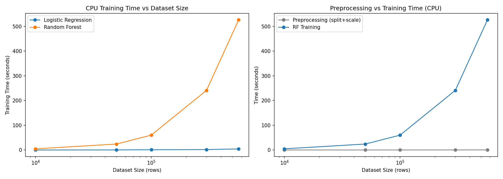
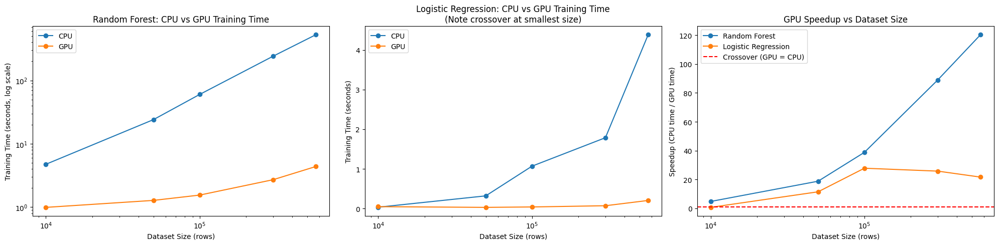
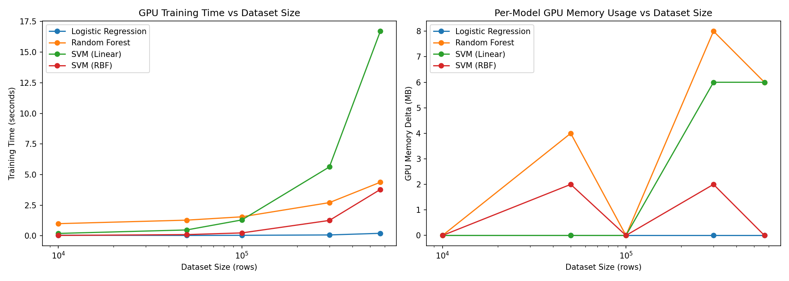

# Fraud-Detection---CPU-vs-GPU-analysis

# CPU vs GPU Performance Analysis: A Fraud Detection Benchmark

Most "CPU vs GPU" benchmarks stop at reporting a speedup number. This project tries to
go a step further — it measures *when* GPU acceleration actually pays off, *why* it
doesn't always, and digs into a couple of genuinely unexpected behaviors that showed up
along the way.

The workload is credit card fraud detection, built on top of an existing open-source
benchmark by Muhammad Saad
([github.com/Arman001/fraud-deteciton-ml](https://github.com/Arman001/fraud-deteciton-ml)).
I reproduced his baseline pipeline, then extended it with dataset-scaling experiments,
GPU memory profiling, and a couple of bug fixes that turned out to be interesting in
their own right.

## Why this project

"Just use GPU, it's faster" is a common assumption, but it isn't always true — especially
at small scale, where setup overhead can outweigh any computational savings. I wanted
real numbers showing where that line actually falls, for more than one algorithm,
rather than taking the claim on faith.

## Dataset

[Credit Card Fraud Detection Dataset 2023](https://www.kaggle.com/datasets/nelgiriyewithana/credit-card-fraud-detection-dataset-2023)
from Kaggle — 568,630 transactions, 28 PCA-anonymized features (`V1`–`V28`) plus
`Amount`, with a binary `Class` label.

One thing worth flagging upfront: this dataset is artificially balanced (50% fraud,
50% genuine) through resampling. Real-world fraud data is nowhere close to this —
usually under 1% of transactions are fraudulent. So these results reflect a best-case,
balanced scenario, not production conditions.

## What I did

1. Reproduced the original CPU and GPU pipelines — Logistic Regression, Random Forest,
   SVM (Linear), and SVM (RBF).
2. Measured training time at five dataset sizes (10k, 50k, 100k, 300k, and the full
   568,630 rows), on both CPU (scikit-learn) and GPU (RAPIDS cuDF/cuML).
3. Split out preprocessing time (train/test split + feature scaling) from training
   time, to see where time actually goes.
4. Tracked per-model GPU memory usage.
5. Fixed two bugs I ran into while doing this (more below) — one of them was
   interesting enough to be worth a section on its own.

---

## Results

### CPU: training time dominates, preprocessing barely registers



The left panel shows Random Forest training time growing much faster than Logistic
Regression as the dataset grows — RF goes from about 4.75 seconds at 10k rows to nearly
9 minutes (526 seconds) at the full 568k rows, while LR stays under 5 seconds even at
full scale. The right panel makes the more important point: preprocessing (the gray
line) stays essentially flat and near-zero across every size tested, while RF training
(blue) does all the growing. **If you're trying to speed this pipeline up, preprocessing
isn't where the time is going — training is.**

### CPU vs GPU: the crossover point depends on the algorithm



This is the core result of the project. Random Forest (left panel, log scale) shows GPU
pulling ahead immediately and the gap widening steadily as data grows. Logistic
Regression (middle panel) tells a different story — at 10k rows the two lines are
essentially on top of each other, and the speedup chart on the right confirms it: GPU is
actually *slower* than CPU for LR at 10k rows (0.70x), because the overhead of GPU setup
and data transfer outweighs the (very small) computation being done.

| Dataset Size | LR Speedup (CPU/GPU) | RF Speedup (CPU/GPU) |
|---|---|---|
| 10,000 | 0.70x (GPU is slower) | 4.79x |
| 50,000 | 11.49x | 18.82x |
| 100,000 | 27.83x | 38.81x |
| 300,000 | 25.82x | 89.01x |
| 568,630 | 21.68x | 120.31x |

Random Forest's speedup curve (right panel, blue) is smooth and keeps climbing all the
way to 120x at full scale — the kind of result you'd expect from an algorithm that
parallelizes naturally (many independent decision trees). Logistic Regression's curve
(orange) tells a more complicated story: it climbs to a peak of ~28x at 100k rows, then
*declines* at 300k and 568k. That dip turned out to have an explanation — see below.

### Why does LR's speedup drop after 100k rows?

While running the 300k-row experiment, cuML printed this warning:

```
[CUML] [warning] L-BFGS stopped, because the line search failed to advance
```

That's the GPU-side optimizer struggling to converge cleanly at that data size. Putting
this together with the speedup dip at the same dataset size, the likely explanation is
that the optimizer needed extra internal iterations to converge past 100k rows, which
ate into the time savings that would otherwise come from running on GPU. I can't verify
this with complete certainty without profiling the optimizer internals, but the
correlation between the warning and the speedup drop, at exactly the same dataset size,
is a reasonable connection to draw.

### A GPU "cold start" effect, and it's a big one

Across multiple runs, the very first GPU operation in a session was dramatically
slower than every operation after it — feature scaling, for instance, took 13–20
seconds on the first call and then 0.01–0.02 seconds on every subsequent call, a
700–1000x difference. This happened consistently across separate runs, though not
always on the same step (sometimes it landed on preprocessing, sometimes on the first
model's training) — which points to CUDA context initialization and/or JIT kernel
compilation (via NVRTC) rather than something specific to one operation.

Practically, this means **any GPU benchmark measuring just one run will badly overstate
the cost of whatever happens to run first.** All the numbers reported above come from
runs after this warm-up period.

### GPU models at scale — and an unexplained kernel quirk



The left panel shows all four GPU models across dataset sizes. Logistic Regression
stays near zero throughout — it's a genuinely cheap operation on GPU. Random Forest
grows smoothly. SVM (both kernels) does something different: it tracks closely with
the other models up to 100k rows, then grows sharply — SVM Linear goes from 0.19
seconds at 10k rows to 16.7 seconds at 568k rows, ending up as the slowest model tested
at full scale.

What's odd is the relationship between the two SVM kernels: **Linear is consistently
slower than RBF at every single size tested.** That's backwards from typical CPU
intuition, where the non-linear RBF kernel is usually the more expensive one. I don't
have a confirmed explanation for this — it's most likely down to how cuML's underlying
solver is implemented for each kernel, but I'm flagging it as an open question rather
than guessing at a mechanism I haven't verified.

**Note on scope:** SVM was only scaled on GPU, not CPU. The original benchmark's CPU
notebook also skipped SVM for exactly this reason — at full dataset size it takes
on the order of minutes per run, which made a full five-size CPU sweep impractical
here.

### GPU memory usage: a flat result, with a plausible explanation

The right panel above shows per-model GPU memory deltas (not cumulative usage — each
model's actual memory footprint, measured before/after `fit()` with explicit cleanup in
between). The numbers stayed small — 0 to 8 MB — with no clear trend by model or
dataset size.

Two things likely explain this:

- RAPIDS' memory manager (RMM) uses a pool allocator that reserves a large chunk of
  memory upfront. Once that pool exists, individual model training mostly reuses it
  instead of requesting new memory from the GPU driver — so there's very little new
  allocation left to measure.
- The dataset itself is small in absolute terms. At full scale it's about 66 MB in
  float32 — tiny next to the roughly 1 GB+ baseline memory footprint that CUDA and
  RAPIDS occupy just by being loaded. Per-model differences are likely well below what
  this measurement approach can resolve.

This didn't produce an interesting standalone trend, but it does support the project's
main conclusion: for this workload, **training time — not memory — was the real
constraint.**

---

## Bugs found and fixed

**1. Data leakage in feature scaling.** The original pipeline fit `StandardScaler` on
the entire dataset *before* splitting into train/test, which leaks test-set statistics
into the "unseen" test data. Fixed by fitting the scaler on the training split only,
then transforming the test split with those training-derived statistics.

**2. A cuDF index-alignment bug.** This one took a bit of debugging. After splitting
data with `train_test_split`, the resulting train/test DataFrames keep their original
(shuffled) row indices — not a clean `0, 1, 2, ...` sequence. When I assigned a scaled
column back using `cuML`'s `fit_transform()` output, which comes back with its own
fresh index starting at 0, cuDF tried to align the two by index rather than by
position — and where the indices didn't match, it silently filled in `NaN`. The same
code works fine on CPU, because `sklearn`'s `fit_transform()` returns a plain NumPy
array with no index at all, so pandas just assigns by position. Fixed by resetting the
index on the split DataFrames before reassigning the scaled column.

---

## Repository structure

```
├── notebooks/
│   ├── Fraud_Detection_CPU_Final.ipynb
│   └── Fraud_Detection_GPU_Final.ipynb
├── results/
│   ├── cpu_scaling_results.csv
│   ├── gpu_scaling_results.csv
│   └── final_comparison.csv
├── plots/
│   ├── cpu_scaling_plot.png
│   ├── gpu_scaling_plot.png
│   └── final_crossover_comparison.png
└── README.md
```

## How to run this

1. Download the dataset from Kaggle (linked above) as `creditcard_2023.csv`.
2. Run `Fraud_Detection_CPU_Final.ipynb` in any standard Python environment.
3. Run `Fraud_Detection_GPU_Final.ipynb` in a CUDA-enabled environment — I used Google
   Colab with a T4 GPU runtime. RAPIDS (`cudf`, `cuml`) installs within the notebook
   itself.
4. Both notebooks save scaling results as CSVs; combine them to reproduce the final
   crossover comparison above.

## Limitations

- The dataset's artificial class balance means these results reflect a best-case
  scenario — real fraud data's extreme imbalance could change both model behavior and
  the CPU/GPU performance picture.
- SVM wasn't benchmarked on CPU across all five sizes, for the reasons noted above.
- GPU memory measurements reflect per-call deltas under RMM's pool allocator, which may
  understate each model's true peak memory footprint.
- All GPU numbers come from a single hardware target (NVIDIA T4 via Google Colab) —
  absolute numbers would likely shift on different hardware, though the qualitative
  trends (crossover existing, RF scaling better than LR, cold start) would probably hold.